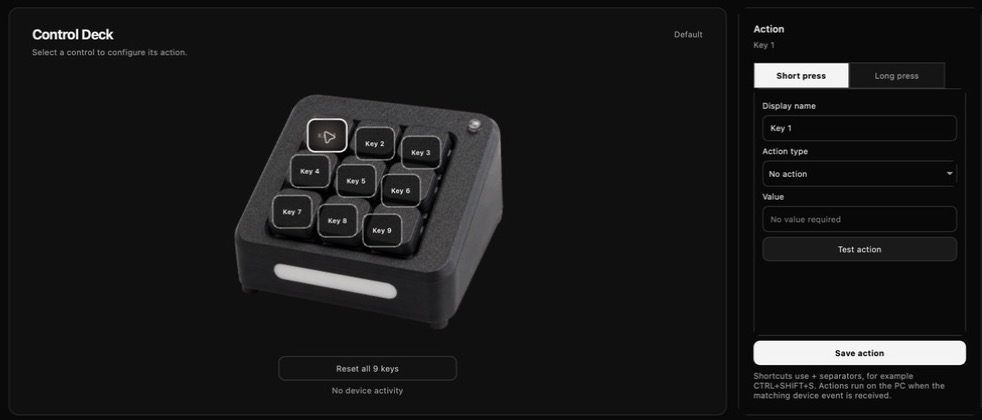
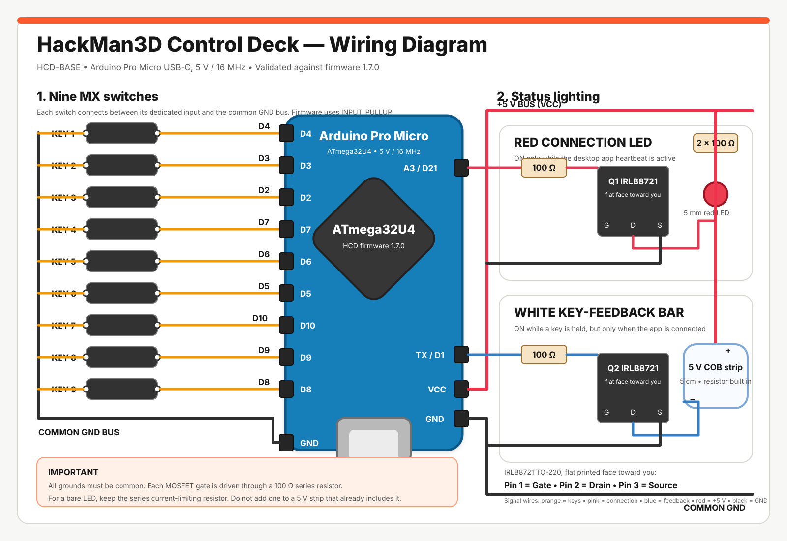

# HackMan3D Control Deck


[](https://paypal.me/Hackman3D)

HackMan3D Control Deck (HCD) is a programmable desktop controller built around an
Arduino Pro Micro. The repository contains the Windows and macOS configuration
app, the branded HackMan interface and the device firmware.

## Download version 1.1.0

The project is currently private. These downloads are available only to people
who have access to this repository.

- [Download for macOS (.dmg)](https://github.com/HackMan3D/Hackman3D-Control-Deck/releases/download/v1.1.0/HackMan3D-Control-Deck-macOS-1.1.0.dmg)
- [Download for Windows (.exe)](https://github.com/HackMan3D/Hackman3D-Control-Deck/releases/download/v1.1.0/HackMan3D-Control-Deck-Windows-1.1.0-Setup.exe)

## Interface


Select any key on the 3D preview to configure its short-press and long-press
actions from the editor.



## How it works

1. Connect the HCD to the computer and keep the desktop application running.
2. Install or update the integrated HCD firmware directly from the application's
   **Firmware** manager. Arduino IDE is not required.
3. The application detects the controller and maintains the connection LED
   through the `HCD_PING` / `HCD_PONG` heartbeat.
4. Create or select a profile, then click one of the nine keys in the 3D
   preview.
5. Assign a shortcut, system command, text, website or application to the short
   press and, optionally, a different action to the long press.
6. Minimize the application to the macOS menu bar or Windows notification area;
   profiles and actions continue to work in the background.

## HCD-BASE hardware

- 9 MX switches in a 3 × 3 layout
- 1 red PC-connection LED
- 1 white key-feedback LED
- Arduino Pro Micro (ATmega32U4, 5 V / 16 MHz)

The connection LED is controlled by the app heartbeat. It turns off about three
seconds after the app stops responding. The feedback LED remains on while one or
more of the nine MX keys is held, but only while the desktop app is connected.

The V1 deliberately has no rotary encoders. Pins D14 through D20 remain free for
a possible V2.

## Wiring



The nine switches use the Pro Micro's internal pull-ups and share a common
ground. The connection LED and key-feedback light are switched by separate
IRLB8721 MOSFETs. See the [complete wiring notes](docs/WIRING.md) before
powering the controller.

## HCD Plus hardware

The repository also contains the first HCD Plus firmware target:

- 12 physical buttons connected through an MCP23017;
- 2 analog potentiometers on A0 and A1;
- one push switch on each potentiometer;
- the same red connection LED and white action-feedback LED as HCD-BASE;
- automatic identification as `HCD-PLUS`.

The desktop firmware manager lets the builder choose **HCD-BASE** or
**HCD Plus** before flashing a new compatible board. Once programmed, the
application reads the model identifier automatically and displays either the
9-control Base editor or the 12-button Plus editor with its two clickable
potentiometers.

See the [HCD Plus wiring table](docs/HCD_PLUS_WIRING.md) for the complete
MCP23017, potentiometer and LED pin assignment.

## Support matters

HackMan3D Control Deck is designed, developed and shared free of charge.
Donations help fund prototypes, electronics, printing tests and the time needed
to improve the firmware and the macOS/Windows applications. Feedback and social
media follows are also important: they help validate ideas and make the project
visible.

- [Support development with PayPal](https://paypal.me/Hackman3D)
- [Send feedback by email](mailto:hackman3d.pro@gmail.com?subject=HackMan3D%20Control%20Deck%20feedback)
- [Creality Cloud](https://www.crealitycloud.com/user/5221417142)
- [MakerWorld](https://makerworld.com/fr/@HackMan3D)
- [TikTok](https://www.tiktok.com/@hackman3d)
- [Instagram](https://www.instagram.com/hackman_3dprint/)
- [YouTube](https://www.youtube.com/@hackman3D)

## HCD roadmap

The progress indicators in the application show only a percentage. No donation
amount or financial target is stored or displayed. The exact feature set will
evolve after prototype testing and community feedback.

### HCD Plus

The Plus edition expands the physical controls while keeping the same software
and the same two status lights:

- 12 physical buttons;
- separate short-press and long-press assignments, providing up to 24 functions;
- 2 configurable potentiometers, for example for volume or another continuous
  control;
- the same connection LED and action-feedback LED as HCD-BASE;
- configuration and integrated firmware installation from the HCD application.

### HCD Pro

The Pro edition focuses on direct visual identification and a more compact,
interactive surface:

- multiple touch buttons, with the final quantity to be defined;
- application images sent directly from the desktop application and displayed
  on the corresponding touch controls;
- 4 additional physical buttons;
- 2 configurable potentiometers;
- the same connection LED and action-feedback LED as HCD-BASE and HCD Plus;
- configuration and integrated firmware installation from the HCD application.

Support for the current HCD directly contributes to the research and prototypes
needed to explore these Plus and Pro editions.

## Repository layout

```text
firmware/HackMan3DControlDeck/       HCD-BASE firmware
firmware/HackMan3DControlDeckPlus/   HCD Plus firmware
software/                            shared PySide6 desktop app
docs/                                protocol and wiring notes
```

## Desktop app

Python 3.11 or newer is recommended. The application supports Windows and
macOS.

```powershell
cd software
py -m venv .venv
.venv\Scripts\activate
python -m pip install -e .
hackman3d-control-deck
```

The app scans serial ports automatically. Profiles are stored in the user's
application-data folder and can be edited from the right-hand action panel.
Arduino and USB serial ports are prioritised during discovery, and unsuitable
ports are skipped quickly. The red software indicator mirrors the physical
connection light on the Control Deck.
The monochrome links beside the HackMan logo open the official Creality Cloud,
MakerWorld, TikTok, Instagram and YouTube pages, the contact email composer and
the PayPal support page.
A translated support banner explains that the project is shared free of charge
and provides direct actions for sending feedback or supporting continued work.
The app can check a release manifest in the background and offer the correct
macOS or Windows download when a newer desktop version is available.
The same manifest supplies the HCD Plus and HCD Pro roadmap percentages. Only
the percentages are transmitted and displayed; no donation amount or financial
target is stored by the application.
The serial port is identified through the HCD protocol. The interface displays
the product name reported by the firmware instead of the operating-system port
such as `cu.usbmodem101`; `HCD-BASE` identifies the current hardware model and
leaves room for future V2 or Pro variants.
The firmware manager embeds HCD-BASE firmware 1.7.0 and the official AVRDUDE
tool for macOS and Windows. It can safely update an identified Control Deck or,
after an explicit warning, install HCD on a new 5 V / 16 MHz ATmega32U4
Leonardo/Pro Micro. The application remains open throughout bootloader
detection, upload and verification, then reconnects automatically.
For keyboard actions, the editor offers common shortcuts while still accepting
custom combinations. The shortcut list adapts to macOS or Windows and shows the
purpose beside every key combination. System commands provide volume up/down,
mute, play/pause, previous/next track and screen brightness controls. For launch
actions on macOS, it lists the applications
installed in the Applications folders and keeps the manual file picker available.
Selecting an application fills its name automatically and displays its native
icon directly over the matching key on the central 3D Control Deck preview.
Clicking a key in the preview opens its editor. Profiles can be created,
renamed and deleted from the sidebar; deletion always requires confirmation.
Profiles can also be duplicated, exported as portable `.hcdprofile` files,
imported on another computer, or included in a complete `.hcdbackup` archive.
Applications can be dragged directly from Finder or Explorer onto a preview
key to create a launch action and retrieve the native application icon.
Each key has separate **Short press** and **Long press** editor tabs. Both tabs
support their own single action and test button; the long-press tab also
provides a configurable hold duration. Older sequence-based profiles are
migrated by preserving the first short-press and long-press action.
The preview's red connection LED follows the live heartbeat, and its white front
bar remains illuminated while at least one physical key is held down.
On macOS, volume up, volume down and mute use the native audio command and do
not require Accessibility permission. Keyboard injection, brightness and media
key events still require macOS Accessibility authorization.
A live diagnostics window reports the HCD model, firmware, serial port,
heartbeat, every available physical control, both LED states and the two live
potentiometer values on HCD Plus.
When an older compatible HCD firmware is detected, the application offers to
open the integrated firmware manager and install the included update.
Changing the action type clears the previous editor values to avoid mixing two
configurations. A centered button below the 3D preview resets all nine key
assignments in the current profile after confirmation.
The editor reports duplicate short-press or long-press assignments in the
current profile. Optional local-only statistics count short and long key uses
without storing action values, typed text, URLs or application names.
The macOS permissions assistant reports Accessibility status and opens the
correct System Settings page.
The minimum white feedback LED duration is adjustable from 0 to 2000 ms. The
setting is sent automatically to HCD-BASE firmware 1.7.0 at every connection.
The language selector in the profile sidebar updates the interface immediately
and supports English, French, Italian, Spanish, Portuguese, Chinese, German,
Hindi, Arabic, Bengali, Indonesian, Russian, Japanese, Korean, Turkish,
Vietnamese and Thai. Arabic automatically switches the interface to a
right-to-left layout.
On Windows, the **Run in background** button hides the window while keeping the
serial heartbeat and configured actions active. Use the notification-area icon
to reopen or fully quit the app.

On macOS, the yellow minimize button sends HCD directly to the menu bar. The
Dock icon disappears while HCD runs in the background; the menu-bar icon reopens
the window and restores its Dock icon. HCD intercepts the native yellow button
before AppKit starts miniaturizing, so no blank or separate window thumbnail is
created in the Dock.
If the user pins HCD with **Keep in Dock**, clicking that launcher restores the
existing interface instead of creating a blank window.
**Start with Mac** installs a per-user
login agent. **Start minimized in menu bar** separately controls whether HCD
opens its window or starts directly in the macOS menu bar.

### Release feed

`release/manifest.example.json` documents the optional feed used for desktop
updates and the Plus/Pro roadmap. The feed is disabled by default while the
project is private. It can be tested by setting `HCD_RELEASE_MANIFEST_URL`
without publishing any repository. Publishing a new version requires changing
`latest_version`, the two platform download links and, when appropriate, the
two integer roadmap percentages. The feed deliberately contains no donation
amounts.

### macOS application

On a Mac, run the packaging script to create the native application bundle:

```bash
cd software
./build_macos.sh
```

The result is `software/dist/HackMan3D Control Deck.app`. Detailed installation
and permission notes are in [docs/MACOS.md](docs/MACOS.md).

Run `./build_dmg.sh` afterward to create the branded drag-to-Applications
installer.

### Windows application

On a Windows 10 or Windows 11 computer, install Python 3.11 or newer and Inno
Setup 6, then run `software\build_windows.ps1` from PowerShell. The script builds
the portable application and creates
`software\dist\HackMan3D-Control-Deck-Windows-1.1.0-Setup.exe`. The installer is
per-user, requires no administrator rights, includes the HCD firmware and AVRDUDE,
and provides clean Start menu, optional desktop and uninstall entries.

## Firmware

The desktop application contains separate HCD-BASE and HCD Plus firmware
images and flashes the selected model directly from the **Firmware** manager.
Arduino IDE is not required for normal installation or updates. A programmed
controller identifies its own model, so later updates automatically select the
matching firmware.

The source sketch remains available in
`firmware/HackMan3DControlDeck/HackMan3DControlDeck.ino` and
`firmware/HackMan3DControlDeckPlus/HackMan3DControlDeckPlus.ino` for firmware
development. Both use only the standard Arduino core.

`software/build_firmware.sh` produces the branded firmware bundled with the
app. It gives each model its own USB product name and sets the manufacturer to
**HackMan3D**.

See the [HCD-BASE wiring notes](docs/WIRING.md) or the
[HCD Plus wiring notes](docs/HCD_PLUS_WIRING.md) before connecting hardware.
