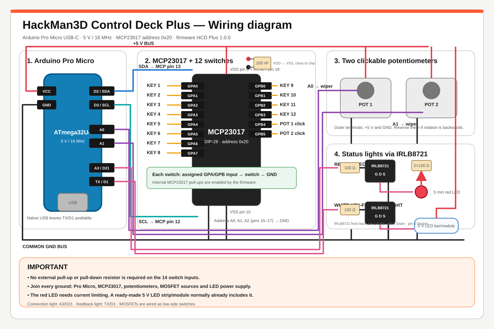

# HCD Plus wiring

HCD Plus uses an Arduino Pro Micro (ATmega32U4, 5 V / 16 MHz) and one
MCP23017 I/O expander at address `0x20`. The firmware uses the Arduino `Wire`
library directly; no third-party MCP23017 library is required.

## Pro Micro connections

| Function | Pro Micro pin |
| --- | --- |
| MCP23017 SDA | D2 / SDA |
| MCP23017 SCL | D3 / SCL |
| Encoder 1 A / CLK | A0 |
| Encoder 1 B / DT | A1 |
| Encoder 2 A / CLK | A2 |
| Encoder 2 B / DT | D4 |
| Connection-light MOSFET gate | A3 / D21 |
| Key-feedback MOSFET gate | TX / D1 |
| MCP23017 supply | VCC (5 V) |
| Common ground | GND |

The two rotary controls are powered EC11/KY-040-style modules with five pins:
`GND`, `+`, `SW`, `DT` and `CLK`. Connect `+` to the Pro Micro's 5 V `VCC` and
`GND` to the common ground. The signal wiring is:

| Module pin | Encoder 1 | Encoder 2 |
| --- | --- | --- |
| `+` | VCC 5 V | VCC 5 V |
| `GND` | Common GND | Common GND |
| `SW` | MCP23017 GPA4 | MCP23017 GPA5 |
| `DT` | Pro Micro A1 | Pro Micro D4 |
| `CLK` | Pro Micro A0 | Pro Micro A2 |

If rotation is backwards, exchange `DT` and `CLK` for that encoder.

## MCP23017 connections

Tie `A0`, `A1` and `A2` on the MCP23017 to GND to select address `0x20`.
Connect `RESET` to VCC. Power the expander from the Pro Micro's VCC and GND.
Place a 100 nF ceramic decoupling capacitor directly between the MCP23017 VDD
and VSS pins.

All controls are active-low and use the MCP23017's internal pull-ups. Connect
the other side of every switch to the common GND.

| Control | MCP23017 input |
| --- | --- |
| Key 1 | GPB0 |
| Key 2 | GPB1 |
| Key 3 | GPB2 |
| Key 4 | GPB3 |
| Key 5 | GPB4 |
| Key 6 | GPB5 |
| Key 7 | GPB6 |
| Key 8 | GPB7 |
| Key 9 | GPA0 |
| Key 10 | GPA1 |
| Key 11 | GPA2 |
| Key 12 | GPA3 |
| Encoder 1 click | GPA4 |
| Encoder 2 click | GPA5 |

`GPA6` and `GPA7` remain available for a later hardware revision.

## Status lights

The two IRLB8721 low-side MOSFET circuits are identical to HCD-BASE:

- A3/D21 drives the red connection light through a 100 Ω gate resistor.
- TX/D1 drives the white action-feedback light through a 100 Ω gate resistor.
- Each MOSFET source connects to GND.
- Each MOSFET drain connects to the negative side of its light.
- The positive side of each light connects to 5 V with the appropriate
  current limiting.

All grounds must be common. The white feedback light only operates while the
desktop app heartbeat is active.
